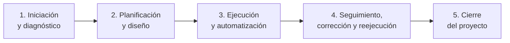

# FinLab Eats - Gestión y Automatización de Pruebas de Software

## Proyecto de testing

Este repositorio contiene una aplicación web de reparto de comida tipo DiDi Food denominada **FinLab Eats**, utilizada como caso de estudio para un proyecto de gestión y automatización de pruebas de software.

La aplicación cuenta con frontend, backend, base de datos y diferentes servicios que participan en procesos como consulta de restaurantes, usuarios, órdenes y pagos. También utiliza herramientas de infraestructura y despliegue como Docker, Kubernetes, Helm y Terraform.

Durante la ejecución del proyecto se detectaron problemas para levantar correctamente los servicios del backend. En una de las pruebas de despliegue, Terraform y Helm permanecieron varios minutos intentando crear los recursos hasta finalizar con el error:

```text
Error: context deadline exceeded
```

A partir de esta situación, el proyecto de testing se enfoca en mejorar la detección temprana de fallas relacionadas con el despliegue, disponibilidad y comunicación entre servicios.

---

# Equipo de trabajo

| Integrante | Rol principal | Rol complementario |
|---|---|---|
| **Alexa** | Project Manager / Scrum Master | QA Lead |
| **Gerardo** | DevOps QA | Tester funcional |
| **Alan** | QA Engineer - Backend e Integración | Automation Engineer |

---

# Objetivo del proyecto

Mejorar la calidad y estabilidad del backend de FinLab Eats mediante una estrategia de pruebas de software enfocada en detectar de forma temprana fallas de despliegue, disponibilidad y comunicación entre servicios, con el propósito de disminuir errores en etapas posteriores y aumentar la confiabilidad de los despliegues del sistema.

---

# 1. Fases del proyecto - EDT / WBS

La Estructura de Desglose del Trabajo (EDT/WBS) divide el proyecto en cinco fases principales. Cada fase contiene actividades específicas de testing y genera resultados que servirán como entrada para la siguiente etapa.

## EDT / WBS del proyecto

```mermaid
flowchart TB
    P["FINLAB EATS<br/>Proyecto de Testing"]

    P --> F1["1. Iniciación y diagnóstico"]
    P --> F2["2. Planificación y diseño"]
    P --> F3["3. Ejecución y automatización"]
    P --> F4["4. Seguimiento, corrección y reejecución"]
    P --> F5["5. Cierre del proyecto"]

    F1 --> T11["1.1 Reproducir y documentar fallas"]
    F1 --> T12["1.2 Identificar componentes críticos"]
    F1 --> T13["1.3 Definir problemática y alcance"]
    F1 --> T14["1.4 Identificar riesgos"]

    F2 --> T21["2.1 Definir estrategia de testing"]
    F2 --> T22["2.2 Seleccionar tipos de pruebas"]
    F2 --> T23["2.3 Diseñar casos de prueba"]
    F2 --> T24["2.4 Definir herramientas y checklist"]
    F2 --> T25["2.5 Definir métricas y criterios"]

    F3 --> T31["3.1 Realizar revisión estática"]
    F3 --> T32["3.2 Ejecutar pruebas de integración"]
    F3 --> T33["3.3 Ejecutar pruebas smoke"]
    F3 --> T34["3.4 Ejecutar pruebas de regresión"]
    F3 --> T35["3.5 Automatizar pruebas seleccionadas"]
    F3 --> T36["3.6 Recolectar evidencias y logs"]

    F4 --> T41["4.1 Registrar y priorizar defectos"]
    F4 --> T42["4.2 Aplicar correcciones"]
    F4 --> T43["4.3 Reejecutar pruebas"]
    F4 --> T44["4.4 Analizar métricas"]

    F5 --> T51["5.1 Validación final"]
    F5 --> T52["5.2 Integrar evidencias"]
    F5 --> T53["5.3 Elaborar reporte y reflexión"]
```



---

# Descripción de las fases de la EDT

## Fase 1. Iniciación y diagnóstico

En esta fase se analiza el estado inicial de FinLab Eats y se establece el alcance del proyecto de pruebas. Se reproducen y documentan las fallas conocidas, se identifican los componentes críticos de la aplicación y se definen los principales riesgos relacionados con la calidad del software.

### Actividades

| EDT | Actividad | Tiempo estimado | Responsable |
|---|---|---:|---|
| 1.1 | Reproducir y documentar la falla de despliegue | 2 h | Gerardo |
| 1.2 | Identificar servicios y componentes críticos | 2 h | Alan |
| 1.3 | Definir problemática, alcance y necesidades | 2 h | Alexa |
| 1.4 | Elaborar matriz de riesgos | 2 h | Alexa / Alan |
| | **Total Fase 1** | **8 h** | |

**Duración calendario estimada:** 2 días.

**Resultado de la fase:** problemática definida, alcance del testing, evidencia inicial y matriz de riesgos.

---

## Fase 2. Planificación y diseño de pruebas

En esta fase se establece la estrategia que se utilizará para comprobar la calidad y estabilidad de FinLab Eats. Se determinan los tipos de pruebas más adecuados, las técnicas de diseño, las herramientas, los casos de prueba, los criterios de aceptación y las métricas del proyecto.

### Actividades

| EDT | Actividad | Tiempo estimado | Responsable |
|---|---|---:|---|
| 2.1 | Definir estrategia y enfoque de testing | 2 h | Alexa |
| 2.2 | Seleccionar pruebas de integración, smoke y regresión | 2 h | Alexa / Alan |
| 2.3 | Diseñar casos de prueba y resultados esperados | 4 h | Alan |
| 2.4 | Preparar checklist y herramientas de prueba | 2 h | Alan / Gerardo |
| 2.5 | Definir métricas y criterios de aceptación | 2 h | Alexa |
| | **Total Fase 2** | **12 h** | |

**Duración calendario estimada:** 3 días.

**Resultado de la fase:** plan de pruebas definido, casos de prueba preparados, herramientas seleccionadas y métricas establecidas.

---

## Fase 3. Ejecución y automatización de pruebas

Esta fase corresponde a la ejecución técnica del testing. Primero se realizan revisiones estáticas sobre código y configuraciones relacionadas con infraestructura. Posteriormente se ejecutan pruebas de integración, smoke y regresión sobre los servicios críticos.

También se automatizan los casos que pueden ejecutarse de manera repetitiva.

### Actividades

| EDT | Actividad | Tiempo estimado | Responsable |
|---|---|---:|---|
| 3.1 | Revisar scripts, Docker, Terraform, Helm y Kubernetes | 3 h | Gerardo |
| 3.2 | Ejecutar pruebas de integración entre servicios | 5 h | Alan |
| 3.3 | Ejecutar pruebas smoke de disponibilidad | 3 h | Gerardo |
| 3.4 | Ejecutar pruebas de regresión | 4 h | Alan |
| 3.5 | Automatizar pruebas seleccionadas | 6 h | Alan |
| 3.6 | Capturar resultados, logs y evidencias | 2 h | Gerardo / Alan |
| | **Total Fase 3** | **23 h** | |

**Duración calendario estimada:** 5 días.

**Resultado de la fase:** resultados de pruebas, evidencias, logs, pruebas automatizadas y defectos detectados.

### Ejemplo de validación smoke

Entre las verificaciones posteriores al despliegue se contempla comprobar los endpoints de disponibilidad del backend:

```text
GET /healthz
GET /readyz
```

Un resultado satisfactorio esperado sería:

```text
HTTP/1.1 200 OK
```

Mientras que una respuesta como:

```text
HTTP/1.1 503 Service Unavailable
```

indicaría que el sistema todavía no está listo y el despliegue no debe considerarse exitoso.

---

## Fase 4. Seguimiento, corrección y reejecución

Los defectos encontrados durante la ejecución serán registrados, clasificados y priorizados según su impacto. Después de realizar una corrección se ejecutarán nuevamente los casos relacionados y las pruebas de regresión necesarias.

Finalmente, se analizarán las métricas obtenidas para determinar si las modificaciones aplicadas produjeron una mejora.

### Actividades

| EDT | Actividad | Tiempo estimado | Responsable |
|---|---|---:|---|
| 4.1 | Registrar y priorizar defectos encontrados | 2 h | Alexa / Alan |
| 4.2 | Analizar y aplicar correcciones | 4 h | Alan / Gerardo |
| 4.3 | Reejecutar casos fallidos y pruebas de regresión | 4 h | Alan |
| 4.4 | Calcular y comparar métricas | 2 h | Alexa |
| | **Total Fase 4** | **12 h** | |

**Duración calendario estimada:** 3 días.

**Resultado de la fase:** defectos documentados, correcciones verificadas, casos reejecutados y métricas actualizadas.

---

## Fase 5. Cierre del proyecto

En la última fase se realizará una validación final del sistema y se organizarán las evidencias obtenidas durante todo el proceso. También se actualizará la documentación del repositorio y se integrarán los resultados en el entregable final.

### Actividades

| EDT | Actividad | Tiempo estimado | Responsable |
|---|---|---:|---|
| 5.1 | Ejecutar validación final | 2 h | Alan / Gerardo |
| 5.2 | Organizar evidencias y documentación | 2 h | Alexa |
| 5.3 | Elaborar reporte final y reflexión | 3 h | Alexa / Gerardo / Alan |
| | **Total Fase 5** | **7 h** | |

**Duración calendario estimada:** 2 días.

**Resultado de la fase:** versión evaluada, evidencias organizadas, documentación actualizada y reporte final del proyecto.

---

# 2. Cronograma general del proyecto

| Orden | Fase | Duración calendario | Esfuerzo estimado | Dependencia |
|---:|---|---:|---:|---|
| 1 | Iniciación y diagnóstico | 2 días | 8 h | Ninguna |
| 2 | Planificación y diseño | 3 días | 12 h | Fase 1 |
| 3 | Ejecución y automatización | 5 días | 23 h | Fase 2 |
| 4 | Seguimiento, corrección y reejecución | 3 días | 12 h | Fase 3 |
| 5 | Cierre del proyecto | 2 días | 7 h | Fase 4 |
| | **TOTAL** | **15 días hábiles** | **62 h** | |

La duración total estimada del proyecto es de **tres semanas de trabajo**, considerando aproximadamente **62 horas de esfuerzo acumulado del equipo**.

---

# Secuencia de ejecución

Las fases deben ejecutarse siguiendo el siguiente orden:



La **Fase 2** depende de que los riesgos y la problemática hayan sido identificados en la Fase 1.

La **Fase 3** comienza una vez definidos los casos, herramientas y criterios de prueba.

La **Fase 4** utiliza como entrada los defectos y resultados generados durante la ejecución.

La **Fase 5** únicamente puede comenzar cuando los defectos críticos hayan sido revisados y los resultados finales estén disponibles.

---

# 3. Roles del equipo

## Perfil de roles QA del equipo

| Integrante | Rol QA | Función principal | Perfil / conocimientos aplicados |
|---|---|---|---|
| **Alexa** | Analista QA / QA Lead | Define la estrategia de pruebas, riesgos, métricas, prioridades y seguimiento del proyecto. | Gestión de calidad, planificación de pruebas, métricas, documentación y coordinación del equipo. |
| **Gerardo** | DevOps QA / Tester funcional | Valida despliegues, infraestructura, disponibilidad de servicios y funcionamiento general después de cada implementación. | Docker, Kubernetes, Helm, Terraform, logs, pruebas smoke y validaciones funcionales. |
| **Alan** | QA Engineer / Automatizador QA | Diseña y ejecuta pruebas de backend e integración y automatiza los casos repetitivos. | APIs, Postman, diseño de casos de prueba, pruebas de integración, regresión y automatización. |


## Alexa - Project Manager / Scrum Master y QA Lead

Responsable de coordinar el proyecto, organizar las actividades del equipo y verificar el cumplimiento del cronograma. Como QA Lead define el enfoque general de pruebas, supervisa los riesgos y métricas y valida que las evidencias obtenidas permitan evaluar la calidad del proyecto.

### Funciones

- Definir alcance y prioridades del proyecto.
- Coordinar actividades y tiempos.
- Elaborar y mantener el cronograma.
- Coordinar el tablero de seguimiento.
- Definir estrategia general de testing.
- Participar en la identificación y priorización de riesgos.
- Definir y analizar métricas.
- Revisar documentación y evidencias.
- Coordinar el cierre y reporte final.

---

## Gerardo - DevOps QA y Tester funcional

Responsable de analizar el proceso de despliegue, infraestructura y disponibilidad de los servicios de FinLab Eats. También participa en pruebas funcionales para comprobar que los principales componentes del sistema se encuentren disponibles después de cada despliegue.

### Funciones

- Revisar Docker, Kubernetes, Helm y Terraform.
- Revisar los scripts utilizados para levantar la aplicación.
- Analizar errores relacionados con el despliegue.
- Preparar y validar el ambiente de pruebas.
- Ejecutar pruebas smoke después de cada despliegue.
- Validar los endpoints `/healthz` y `/readyz`.
- Revisar la disponibilidad de los servicios.
- Recolectar logs y evidencias técnicas.
- Apoyar en la corrección de problemas de infraestructura y configuración.
- Ejecutar pruebas funcionales básicas para comprobar que el sistema pueda utilizarse después del despliegue.

---

## Alan - QA Engineer de Backend e Integración y Automation Engineer

Responsable del diseño, ejecución y automatización de pruebas relacionadas principalmente con el backend y la comunicación entre los diferentes servicios de FinLab Eats.

### Funciones

- Diseñar casos de prueba.
- Ejecutar pruebas de integración.
- Ejecutar pruebas de regresión.
- Realizar pruebas de caja negra sobre las APIs.
- Utilizar Postman para validar endpoints y respuestas.
- Comparar resultados obtenidos contra resultados esperados.
- Analizar respuestas HTTP y errores de comunicación entre servicios.
- Registrar defectos encontrados.
- Automatizar los casos de prueba seleccionados.
- Reejecutar pruebas después de aplicar correcciones.
- Apoyar en la validación final del sistema.

---

# 4. Funciones por rol

Las actividades definidas en la EDT se asignan a los integrantes del equipo de acuerdo con su rol y área de responsabilidad dentro del proyecto.

| Actividad | Descripción | Encargado |
|---|---|---|
| **EDT 1.1 - Reproducir falla de despliegue** | Ejecutar nuevamente el proceso de despliegue para reproducir el error `context deadline exceeded` y recopilar evidencia técnica del problema. | **Gerardo - DevOps QA** |
| **EDT 1.2 - Identificar componentes críticos** | Analizar los servicios principales del backend y determinar cuáles tienen mayor impacto en el funcionamiento de la aplicación. | **Alan - QA Engineer** |
| **EDT 1.3 - Definir problemática y alcance** | Establecer el problema principal del proyecto de testing, las necesidades del sistema y el alcance de las pruebas. | **Alexa - QA Lead / Project Manager** |
| **EDT 1.4 - Elaborar matriz de riesgos** | Identificar los riesgos relacionados con disponibilidad, comunicación entre servicios, despliegues y regresiones. | **Alexa - QA Lead** |
| **EDT 2.1 - Definir estrategia de testing** | Establecer el enfoque general de pruebas que se aplicará durante el proyecto. | **Alexa - QA Lead** |
| **EDT 2.2 - Seleccionar tipos de pruebas** | Seleccionar las pruebas de integración, smoke y regresión de acuerdo con los riesgos identificados. | **Alan - QA Engineer** |
| **EDT 2.3 - Diseñar casos de prueba** | Definir precondiciones, datos de entrada, pasos y resultados esperados para cada caso de prueba. | **Alan - QA Engineer** |
| **EDT 2.4 - Preparar herramientas y checklist** | Configurar herramientas de apoyo como Postman y elaborar una lista de validaciones para los servicios críticos. | **Alan - QA Engineer / Automation Engineer** |
| **EDT 2.5 - Definir métricas** | Establecer las métricas que permitirán evaluar el avance y la efectividad de las soluciones implementadas. | **Alexa - QA Lead** |
| **EDT 3.1 - Revisión estática de infraestructura** | Revisar scripts, Docker, Terraform, Helm y Kubernetes para detectar errores de configuración antes de ejecutar el despliegue. | **Gerardo - DevOps QA** |
| **EDT 3.2 - Ejecutar pruebas de integración** | Comprobar la comunicación entre los diferentes servicios del backend y validar sus respuestas. | **Alan - QA Engineer** |
| **EDT 3.3 - Ejecutar pruebas smoke** | Verificar después del despliegue que los servicios principales y endpoints de disponibilidad se encuentren funcionando. | **Gerardo - DevOps QA** |
| **EDT 3.4 - Ejecutar pruebas de regresión** | Repetir casos previamente aprobados después de realizar cambios para comprobar que no aparezcan nuevas fallas. | **Alan - QA Engineer** |
| **EDT 3.5 - Automatizar pruebas seleccionadas** | Crear o adaptar scripts que permitan ejecutar automáticamente las validaciones repetitivas del sistema. | **Alan - Automation Engineer** |
| **EDT 3.6 - Recolectar logs y evidencias** | Guardar capturas, respuestas HTTP, resultados de pruebas y logs generados durante la ejecución. | **Gerardo - DevOps QA** |
| **EDT 4.1 - Registrar y priorizar defectos** | Documentar los defectos detectados y clasificarlos de acuerdo con su severidad e impacto. | **Alexa - QA Lead** |
| **EDT 4.2 - Analizar y aplicar correcciones** | Analizar la causa de los errores encontrados y realizar los ajustes necesarios en backend o infraestructura. | **Alan / Gerardo** |
| **EDT 4.3 - Reejecutar pruebas** | Volver a ejecutar los casos fallidos y las pruebas de regresión para comprobar las correcciones realizadas. | **Alan - QA Engineer** |
| **EDT 4.4 - Analizar métricas** | Calcular y comparar los resultados obtenidos para determinar si la calidad y estabilidad del sistema mejoraron. | **Alexa - QA Lead** |
| **EDT 5.1 - Validación final** | Ejecutar las pruebas finales para comprobar el estado general del sistema antes del cierre del proyecto. | **Alan / Gerardo** |
| **EDT 5.2 - Organizar evidencias** | Reunir y ordenar capturas, logs, resultados y documentación generada durante el proyecto. | **Alexa - Project Manager** |
| **EDT 5.3 - Elaborar reporte y reflexión** | Integrar los resultados, evidencias y conclusiones del proyecto en el entregable final. | **Alexa / Gerardo / Alan** |

---

# 5. Evidencias verificables en el repositorio

El proyecto utilizará los archivos y directorios del repositorio como evidencia del trabajo realizado.

| Elemento | Ubicación / evidencia |
|---|---|
| Código del backend | `apps/backend/` |
| Código del frontend | `apps/frontend/` |
| Pruebas End-to-End existentes | `tests/e2e/` |
| Pruebas de rendimiento existentes | `tests/perf/` |
| Configuración Helm | `infra/helm/finlab/` |
| Terraform | `terraform/` (raíz del repositorio) |
| Ansible | `infra/ansible/` |
| Scripts de despliegue | `scripts/` |
| Cronograma, EDT, roles y funciones | `README.md` |
| Seguimiento de actividades | GitHub Projects |
| Defectos encontrados | GitHub Issues / tablero del proyecto |

Las nuevas evidencias generadas durante las pruebas podrán incorporarse posteriormente al repositorio mediante capturas, logs, casos de prueba y resultados de ejecución.

---

# Criterios generales de finalización

Una fase se considerará terminada cuando:

1. Las actividades programadas para la fase hayan sido ejecutadas.
2. Los resultados hayan sido registrados.
3. Las evidencias correspondientes se encuentren disponibles.
4. Los defectos críticos hayan sido documentados.
5. La información necesaria para iniciar la siguiente fase esté disponible.

El proyecto completo se considerará finalizado cuando se hayan ejecutado las pruebas definidas, documentado los resultados, revisado los defectos críticos, calculado las métricas y reunido las evidencias necesarias para el entregable final.

---

# Información técnica del proyecto base

## Arquitectura

- **Frontend:** React (Vite) → build estático → Nginx
- **Backend:** Node/Express (API REST) + health checks
- **Base de datos:** PostgreSQL
- **Kubernetes:** Deployments / Services + probes + HPA
- **Helm:** chart `finlab`
- **Terraform:** infraestructura y despliegue
- **Ansible:** automatización
- **Testing existente:**
  - Node Test Runner
  - Playwright
  - k6

---

# Estructura del repositorio

```text
apps/backend            API Node/Express
apps/frontend           React + Vite
tests/e2e               Pruebas Playwright
tests/perf              Pruebas k6
infra/helm/finlab       Helm chart
terraform/               Terraform (raíz del repositorio)
infra/ansible           Ansible
scripts                 Scripts de ejecución y despliegue
```

---

# Inicio rápido

## 1. Revisar prerrequisitos

```bash
scripts/00_prereqs_windows.md
```

## 2. Crear clúster

```bash
scripts/01_cluster_k3d.sh
```

## 3. Levantar PostgreSQL local

```bash
docker compose up -d db
```

## 4. Construir y publicar imágenes

```bash
scripts/02_build_push.sh
```

## 5. Desplegar con Helm

```bash
scripts/03_deploy_helm.sh
```

## 6. Validar resiliencia

```bash
scripts/04_resilience_tests.sh
```

## 7. Port-forward

```bash
scripts/05_port_forward.sh
```

---

# Backend + PostgreSQL en ambiente local

Sin archivo `.env`, el backend intenta conectarse por defecto utilizando:

```text
Host: localhost
Puerto: 5432
Usuario: finlab
Password: finlab
Base de datos: finlab
```

Para levantar PostgreSQL:

```bash
docker compose up -d db
```

Para ejecutar el backend:

```bash
cd apps/backend
npm install
npm run dev
```

Para utilizar una configuración diferente se puede emplear:

```text
apps/backend/.env.example
```

o definir la variable:

```text
DATABASE_URL
```

---
